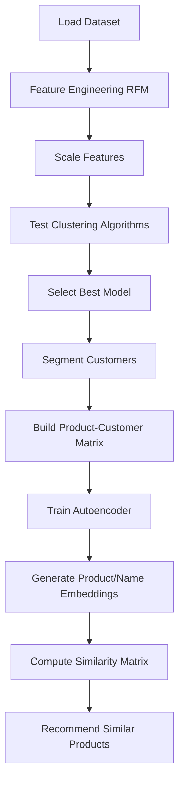

# 🧠 **E-Commerce Customer Segmentation & Product Recommendation Engine**

Dataset: [UCI Online Retail Dataset](https://archive.ics.uci.edu/ml/machine-learning-databases/00352/Online%20Retail.xlsx)

Goal: Combine unsupervised customer segmentation with product-level recommendations using both numerical and textual embeddings.

## Overview

This project performs customer segmentation and builds a hybrid product recommendation system for an e-commerce environment.
It integrates:

1. RFM-based clustering (Recency, Frequency, Monetary features)
2. Multiple clustering algorithms (KMeans, DBSCAN, GMM, etc.)
3. Autoencoder-based product embeddings (collaborative filtering)
4. TF-IDF based name embeddings (content filtering for unseen queries)

Together, these modules enable both customer understanding and intelligent product recommendations — even when the query product does not yet exist in the dataset.

## Step-by-Step Breakdown

### 1. Data Preprocessing
  - Loads the UCI Online Retail dataset
  - Removes missing values and negative quantities
  - Creates RFM (Recency, Frequency, Monetary) features for each customer

### 2. Customer Segmentation
  - Standardizes RFM features
  - Tests multiple clustering algorithms:
    - `KMeans`
    - `DBSCAN`
    - `Agglomerative Clustering`
    - `Gaussian Mixture Models (GMM)`
  - Automatically selects the best algorithm based on Silhouette Score

### 3. Product Representation
  - Builds a Customer–Product matrix (`CustomerID × ProductName`)
  - Transposes it to a Product–Customer matrix for embedding learning

### 4. Autoencoder-Based Embeddings
  - Trains a neural network autoencoder to compress each product’s customer-purchase vector into a 64-dimensional latent space
  - Uses the encoder output as product embeddings
  - Computes cosine similarity between all products to generate a similarity matrix

### 5. Recommendation Function
   ```python
   results = pq.recommend(product_name, top_n=10)
   ```
> Given a product name, retrieves the most similar items from the embedding space using cosine similarity.

### 6. Content-Based Query Handling
  When a new product name is not in the dataset:
  - Uses a TF-IDF or BERT embedding model to embed the query text
  - Finds the most semantically similar existing product in the product embedding matrix
  - Recommends similar products to that matched item
  This allows the system to handle unseen or user-typed queries gracefully.

---

## Technical Flow Summary



---

## Clustering Metrics:

Below is the performance summary for all clustering models tested:

| Algorithm | #Clusters | Silhouette Score |
|------------|------------|-----------------|
| KMeans | 4 | 0.5950947814617117 |
| DBSCAN | 3 | 0.773219416848695 |
| Agglomerative | 4 | 0.5953647530505105 |
| GMM | 4 | 0.31442280630400526 |

---

## Conceptual Summary

| **Method**                 | **Purpose**                                   | **Type**                  |
|-----------------------------|-----------------------------------------------|----------------------------|
| RFM + Clustering            | Segment customers by behavior                | Customer Analytics         |
| Autoencoder Embeddings      | Learn hidden relations between products      | Collaborative Filtering    |
| TF-IDF / BERT Embeddings    | Capture semantic similarity in product names | Content Filtering          |
| Cosine Similarity Search    | Rank similar products efficiently            | Recommendation Engine      |
