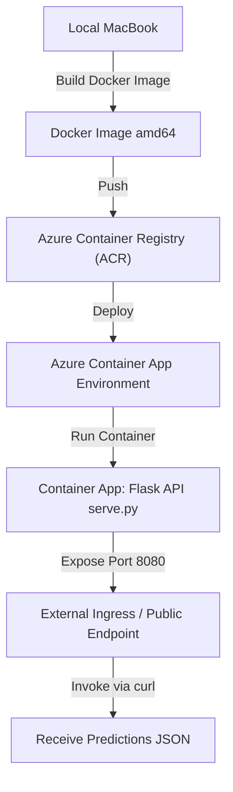
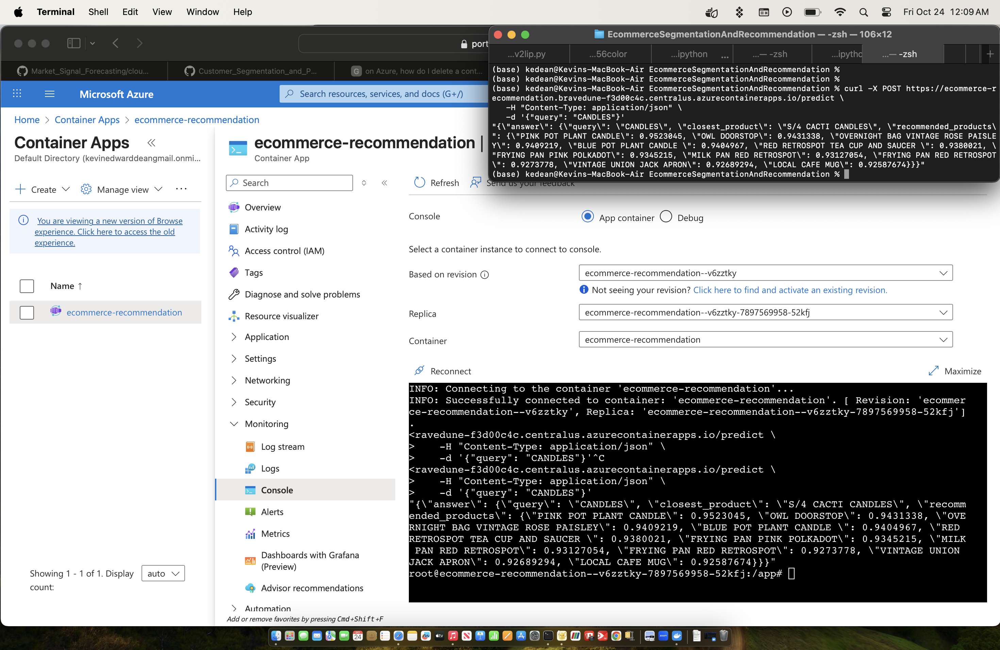

# Ecommerce Segmentation and Recommendation - Azure Container Apps Deployment

This repository demonstrates how to containerize and deploy a Python/Flask-based (sklearn clustering algorithms) with TF-IDF product names vectorizer and Autoencoder embeddings to locate similarities per product query for top-k product recommendations using **Azure Container Apps**.

The deployment was tested successfully using an **amd64 Docker image**.

---

## Table of Contents

1. [Project Overview](#project-overview)  
2. [Local Setup](#local-setup)
3. [Architecture Diagram](#architecture-diagram) 
4. [Docker Build](#docker-build)  
5. [Azure Container Apps Deployment](#azure-container-apps-deployment)  
6. [Testing the Endpoint](#testing-the-endpoint)  
7. [Problems & Solutions](#problems--solutions)
8. [Notes](#notes)

---

## Project Overview

- **Frameworks:** Flask, TensorFlow, scikit-learn, pandas  
- **Docker Architecture:** amd64 (linux/amd64)  
- **Cloud Platform:** Azure Container Apps  
- **Purpose:** Serve a REST API for stock signal forecasting based on sentiment and price data.

---

## Local Setup

1. Clone the repository:
  ```bash
   git clone <repo-url>
   cd Customer_Segmentation_and_Product_Recommendation
  ```

2. Test the Flask app locally:
   ```bash
   python serve.py
   ```
   ```bash
   curl -X POST http://localhost:8080/predict \
      -H "Content-Type: application/json" \
      -d '{"query": "candles"}'
   ```

___

## Architecture Diagram



---

## Docker Build

1. Build the amd64 Docker image:
   ```bash
   docker buildx build --platform linux/amd64 -t ecommerce-recommendation:latest .
   ```

2. Run the container locally for testing (**Note** -> this will not work if running from macOS, you'd need to build the docker image specifically for arm64):
   ```bash
   docker run -p 8080:8080 ecommerce-recommendation:latest
   ````

3. Verify Endpoint:
   ```bash
   curl -X POST http://localhost:8080/invocations \
      -H "Content-Type: application/json" \
      -d '{"query": "CANDLES"}'
   ```

---

## Azure Container Apps Deployment

1. Login to Azure CLI and Azure Container Registry
   ```bash
   az login

   az group create --name ecommerce-recommendation-rg --location centralus

   az acr create \
      --resource-group ecommerce-recommendation-rg \                                
      --name acrecomrec \
      --sku Basic \                                  
      --location centralus \
      --admin-enabled true

   az acr login --name acrecomrec --resource-group ecommerce-recommendation-rg
   ```

2. Tag and push Docker image to ACR:
   ```bash
   docker tag ecommerce-recommendation:latest acrecomrec.azurecr.io/ecommerce-recommendation:latest
   docker push acrecomrec.azurecr.io/ecommerce-recommendation:latest
   ```

3. Create Container App Environment:
   ```bash
   az containerapp env create \
      --name ecom-rec-env \
      --resource-group ecommerce-recommendation-rg \
      --location centralus
   ```

4. Deploy Container App:
   ```bash
   az containerapp create \
      --name ecommerce-recommendation \
      --resource-group ecommerce-recommendation-rg \
      --environment ecom-rec-env \
      --image acrecomrec.azurecr.io/ecommerce-recommendation:latest \
      --cpu 1 \
      --memory 2Gi \
      --ingress external \
      --target-port 8080 \
      --registry-server acrecomrec.azurecr.io \
      --registry-username acrecomrec \
      --registry-password <ACR_PASSWORD>
   ```

5. Retrieve the public endpoint URL:
   ```bash
   az containerapp show \
      --name ecommerce-recommendation \
      --resource-group ecommerce-recommendation-rg \
      --query properties.configuration.ingress.fqdn
   ```

---

## Testing the Endpoint
- Use the **public URL** provided by Azure Container Apps with a POST request:
   ```bash
   curl -X POST https://<public-fqdn>/predict \
      -H "Content-Type: application/json" \
      -d '{"query": "CANDLES"}'
   ```
- Expected response includes RMSE values for Prophet and LSTM predictions.



___

## Problems And Solutions

- No problems were encountered this time after following Azure section in MarketSignalForecasting repository
___

## Notes

- All deployments were performed using Azure Container Apps with `amd64 architecture`.
- Local `ARM64` builds can run on Apple Silicon, but Azure Container Apps requires amd64.
- Endpoint testing should always be performed using the public `FQDN` of the container app.


